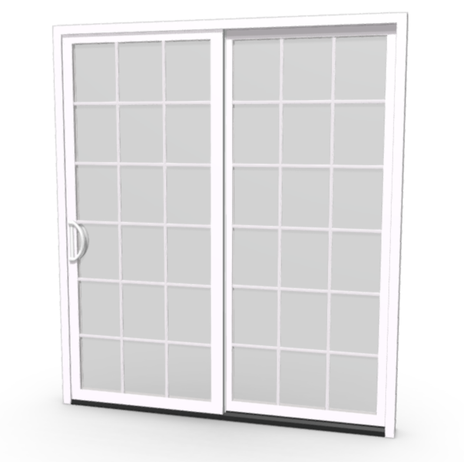
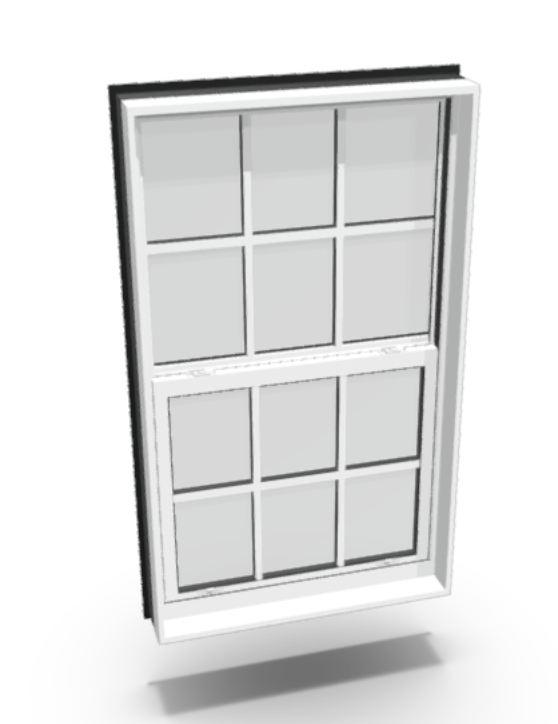
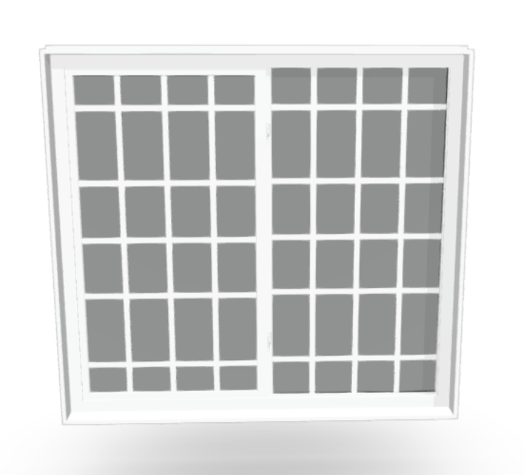
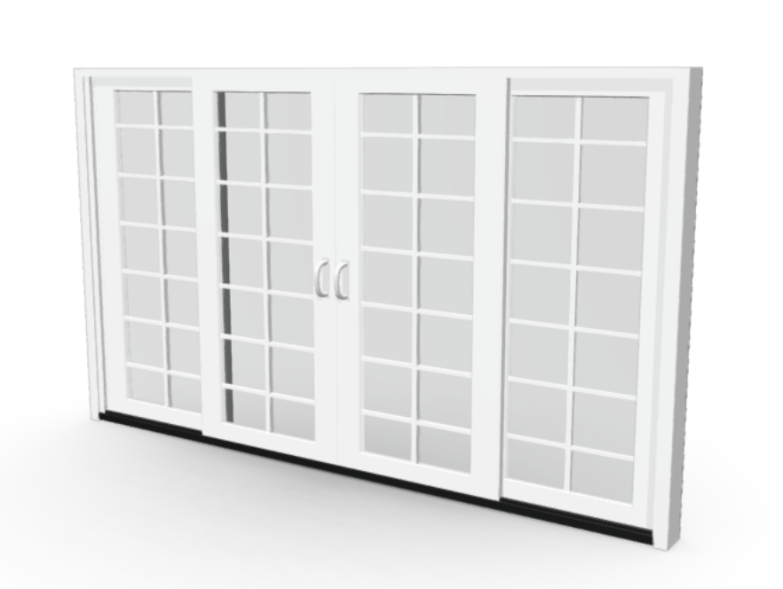
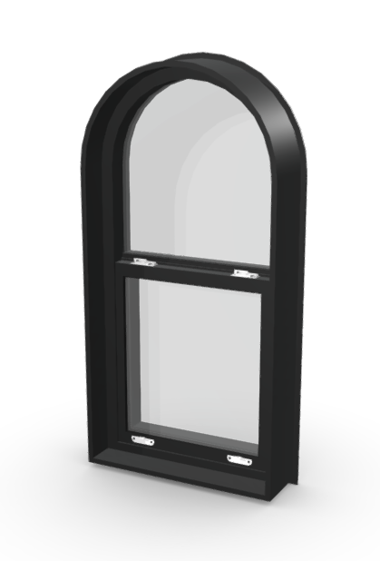
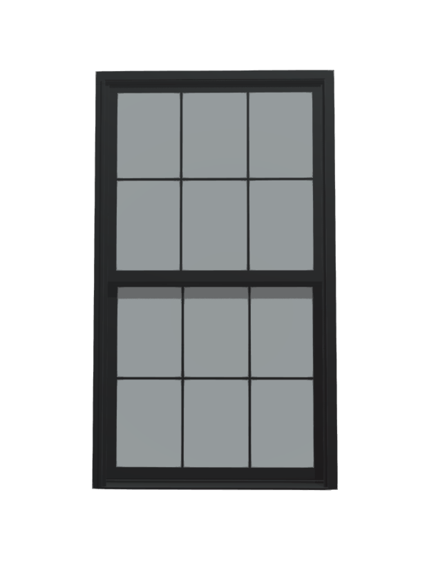

# Pella Impervia Sliding Patio Door

Access the Pella Impervia Sliding Patio Door configurator using the link below:
`https://portoolapp.github.io/configurators/Pella%20Impervia%20Sliding%20Patio%20Door/final.html`

Or click here : 

**[Pella Impervia Sliding Patio Door Configurator](https://portoolapp.github.io/configurators/Pella%20Impervia%20Sliding%20Patio%20Door/final.html)**

Embed the configurator directly into your project using the following code:

```html
<iframe
src="https://portoolapp.github.io/configurators/Pella%20Impervia%20Sliding%20Patio%20Door/final.html"
style="border: none; width: 100vw; height: 100vh;"
allowfullscreen>
</iframe>
```

# Single Hung: Equal (SH5400 / SH5500)   

Access the Single Hung: Equal (SH5400 / SH5500) configurator using the link below:
`https://portoolapp.github.io/configurators/Single%20Hung%20Window/final.html`

Or click here
**[Single Hung: Equal (SH5400 / SH5500)](https://portoolapp.github.io/configurators/Single%20Hung%20Window/final.html)**

Embed the configurator directly into your project using the following code:

```html
<iframe
src="https://portoolapp.github.io/configurators/Single%20Hung%20Window/final.html"
style="border: none; width: 100vw; height: 100vh;"
allowfullscreen>
</iframe>
```

---


# HR5410 Horizontal Slide Window

Access the HR5410 Horizontal Slide Window configurator using the link below:
`https://portoolapp.github.io/configurators/HR5410/final.html`

Or click here:

**[HR5410 Horizontal Slide Window Configurator](https://portoolapp.github.io/configurators/HR5410/final.html)**

Embed the configurator directly into your project using the following code:

```html
<iframe
src="https://portoolapp.github.io/configurators/HR5410/final.html"
style="border: none; width: 100vw; height: 100vh;"
allowfullscreen>
</iframe>
```

This and  previous ones , currently, have both borders .

---

# SGD5470 4-Part Sliding Door

Access the SGD5470 4-Part Sliding Door configurator using the link below:
`https://portoolapp.github.io/configurators/SGD5470/final.html`

Or click here:

**[SGD5470 4-Part Sliding Door Configurator](https://portoolapp.github.io/configurators/SGD5470/final.html)**

Embed the configurator directly into your project using the following code:

```html
<iframe
src="https://portoolapp.github.io/configurators/SGD5470/final.html"
style="border: none; width: 100vw; height: 100vh;"
allowfullscreen>
</iframe>
```

This has no outer border , but it does have the inner border ( for the settings part )
---

# SH5400 Single Hung Radius (SH5400)

Access the SH5400 Single Hung Radius configurator using the link below:
`https://portoolapp.github.io/configurators/SH5400%20Radius/final.html`

Or click here:

**[SH5400 Single Hung Radius Configurator](https://portoolapp.github.io/configurators/SH5400%20Radius/final.html)**

Embed the configurator directly into your project using the following code:

```html
<iframe
src="https://portoolapp.github.io/configurators/SH5400%20Radius/final.html"
style="border: none; width: 100vw; height: 100vh;"
allowfullscreen>
</iframe>
```

Currently this has no outer border or inner border.

# Pella Impervia Double Fiberglass Window

Access the SH5400 Single Hung Radius configurator using the link below:
`https://portoolapp.github.io/configurators/Pella%20Impervia%20Double%20Hung/final.html`
Or click here:

**[Pella Impervia Double Fiberglass Window](https://portoolapp.github.io/configurators/Pella%20Impervia%20Double%20Hung/final.html)**

Embed the configurator directly into your project using the following code:

```html
<iframe
src="https://portoolapp.github.io/configurators/Pella%20Impervia%20Double%20Hung/final.html"
style="border: none; width: 100vw; height: 100vh;"
allowfullscreen>
</iframe>
```

Currently this has no outer border or inner border.
